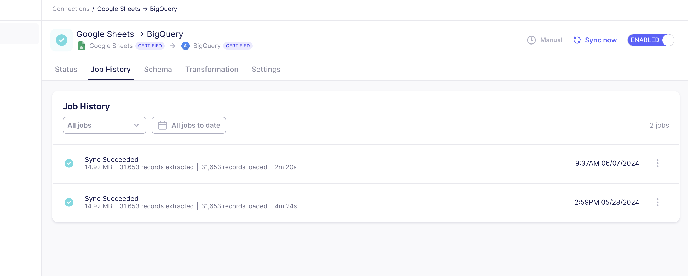
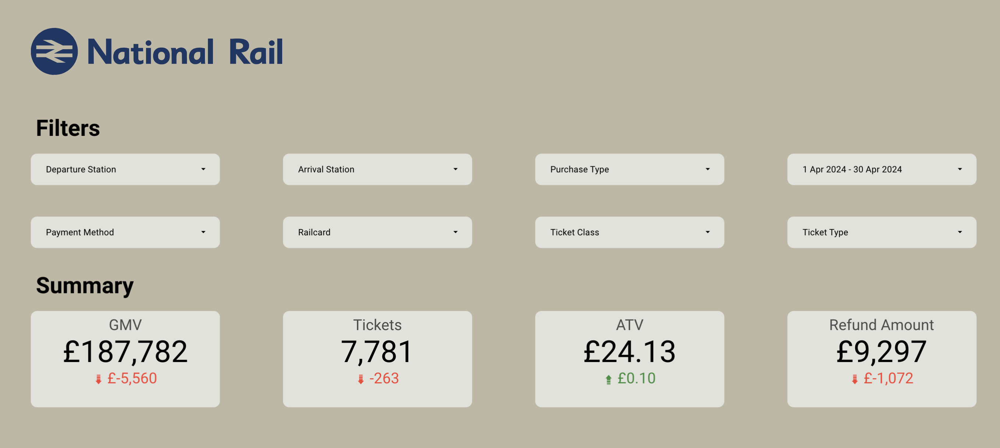

# Maven National Rail Data Pipeline


Raw data source : [Maven Data Playground (UK Train Rides)](https://mavenanalytics.io/data-playground)

Mock train ticket data for National Rail in the UK, from Jan to Apr 2024, including details on the type of ticket, the date & time for each journey, the departure & arrival stations, the ticket price, and more.

We will use the data to create a dashboard for company stakeholders. 

tools used in this Project  :
1. Airbyte
2. BigQuery
3. DBT
4. Looker

## Data Loading

we use [Airbyte](https://airbyte.com/) to load the CSV data from Google Sheets to Bigquery.



Airbyte has full documentation on how to do that on their site [here](https://airbyte.com/how-to-sync/google-sheets-to-bigquery)


## Data Transformation

For data transformation, we're using [DBT](https://github.com/dbt-labs/dbt-core)

since the data is only one table, we only use DBT to transform some columns. 

for example

### Grouping reason_for_delay. 
 the column has some redundant labels which can be grouped into one like 'Weather Conditions' and 'Weather'
```sql
case
    when reason_for_delay = 'Weather Conditions'
    then 'Weather'  
    when reason_for_delay = 'Signal failure'
    then 'Signal Failure'
    when reason_for_delay = 'Staffing'
    then 'Staff Shortage'
    else reason_for_delay
end as reason_for_delay,
```
### Create Routes and fix the Datetime columns

```sql
concat(departure_station, " - ", arrival_destination) as route,
            timestamp(
                (concat(date_of_journey, " ", departure_time))
            ) as date_of_journey,

            timestamp((concat(date_of_journey, " ", arrival_time))) as date_of_arrival,
            
            timestamp(
                (concat(date_of_journey, " ", actual_arrival_time))
            ) as date_of_actual_arrival_time,
            timestamp(
                (concat(date_of_purchase, " ", time_of_purchase))
            ) as date_of_purchase
```
Routes combine departure_station and arrival_destination. 
In the raw data, the date and time are in separate columns, 
we need to concatenate it and cast it as a timestamp. 

### Fix Arrival Time for Overnight Travel
But, what if we have overnight travel? 
we create a new CTE that will use new conditions, if departure < arrival we'll add 24 hours into departure time.
```sql
base2 as (
        select
            * except (date_of_arrival, date_of_actual_arrival_time),
            case
                when date_of_journey > date_of_arrival
                then timestamp_add(date_of_arrival, interval 24 hour)
                else date_of_arrival
            end as date_of_arrival,
            case
                when date_of_journey > date_of_actual_arrival_time
                then timestamp_add(date_of_actual_arrival_time, interval 24 hour)
                else date_of_actual_arrival_time
            end as date_of_actual_arrival_time
        from base
    ),
```

### Delayed Duration
Delayed Duration is how long the actual arrival time is compared to arrival time. from this, we can bucket them into categories.
```sql
base3 as (
        select
            *,
            (
                unix_seconds(date_of_actual_arrival_time)
                - unix_seconds(date_of_arrival)
            ) as delayed_time
        from base2
    )

select
    * except (journey_status),
    {{ dbt_utils.generate_surrogate_key(["route", "date_of_journey"]) }} as trips_id,
    case when delayed_time = 0 then 'On Time' else journey_status end as journey_status,
    case
        when (delayed_time / 60) between 1 and 15
        then '1 - 15 Mins'
        when (delayed_time / 60) between 16 and 30
        then '16 - 30 Mins'
        when (delayed_time / 60) between 31 and 45
        then '31 - 45 Mins'
        when (delayed_time / 60) between 46 and 60
        then '46 - 60 Mins'
        when (delayed_time / 60) > 60
        then ' > 60 Mins'
        else null
    end as delayed_duration
from base3

```
full DBT SQL model can be found [here](dbt/maven_train/models/maven_train/final_maven.sql)


## Data Visualization
The transformed data will be consumed via the looker dashboard :


link to full dashboard [here](https://lookerstudio.google.com/reporting/4c250cf6-8a8d-405e-8e0f-7ece4396de2b/page/p_nltwn37phd)